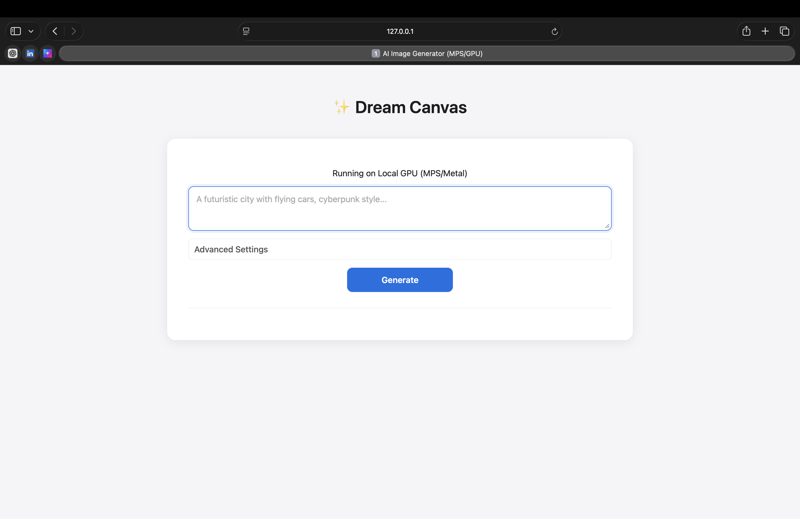
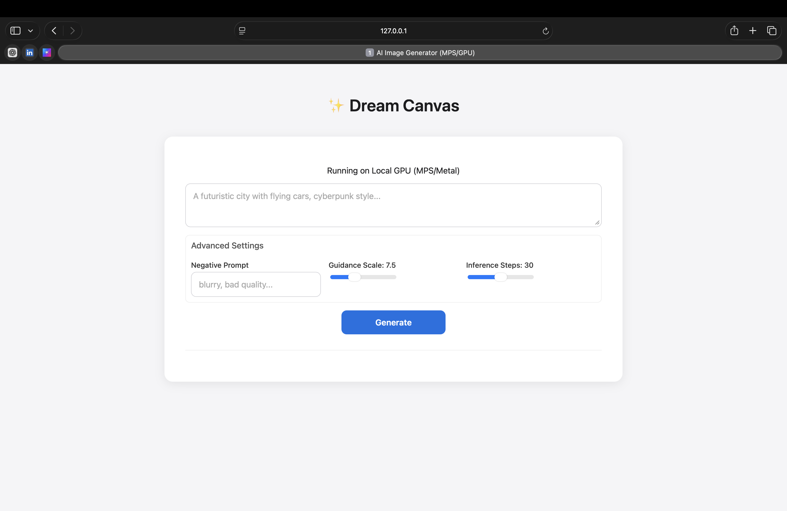
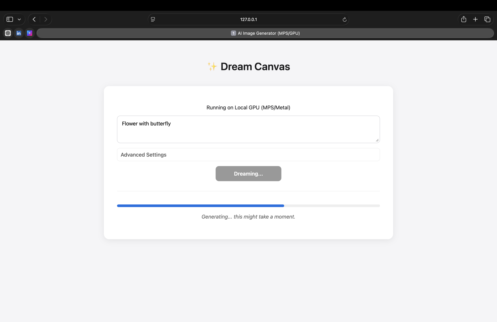
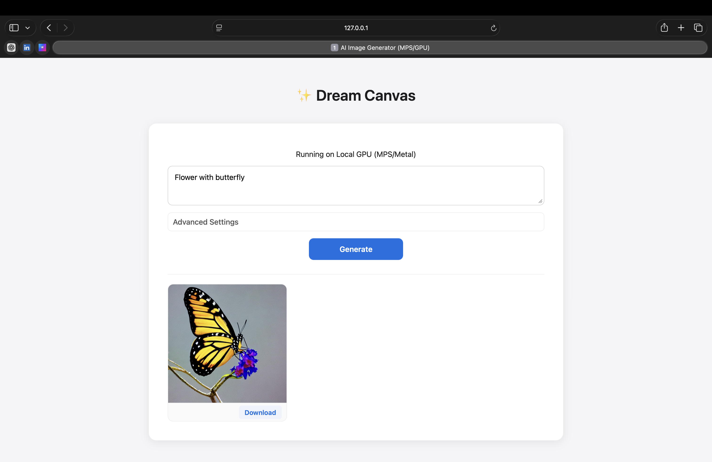
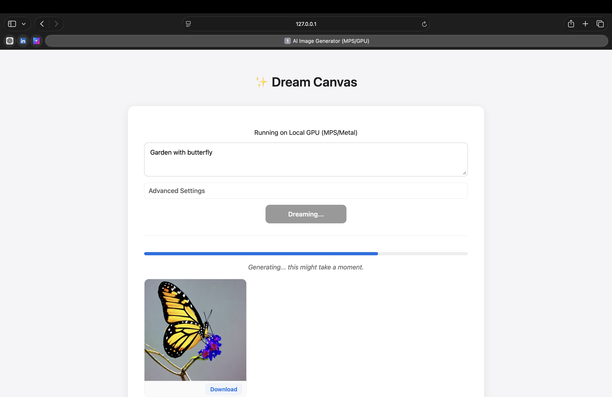
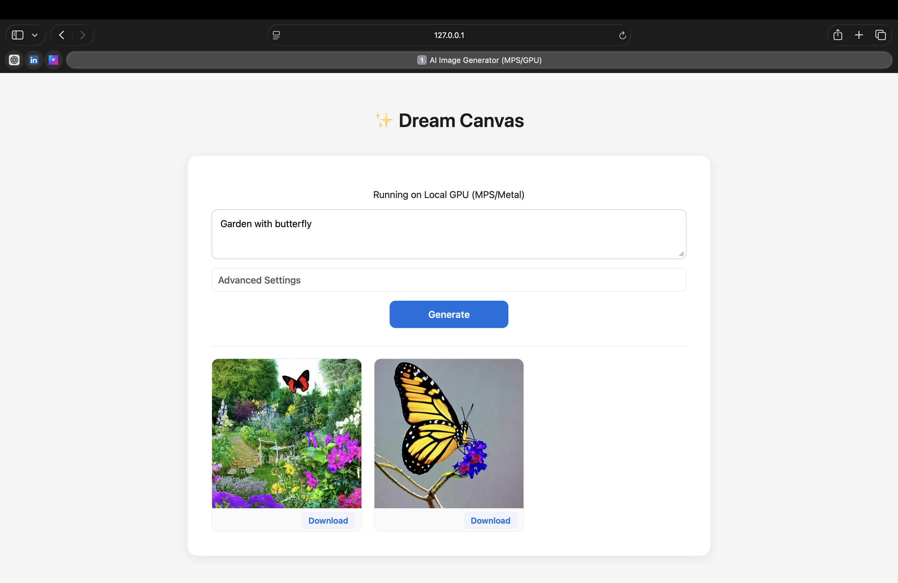

# ✨ Dream Canvas - AI Image Generator

A powerful, local image generation app built for Mac Silicon (M1/M2/M3). It runs Stable Diffusion v1.5 locally using Metal Performance Shaders (MPS) and serves a responsive, feature-rich web UI.

## 🚀 Features

### Core Generation

- **Local GPU Acceleration**: Optimized for macOS MPS/Metal.
- **Precision Handling**: Automatically uses `float32` on MPS to prevent black image artifacts.
- **Advanced Controls**:
  - **Negative Prompt**: Remove unwanted elements (e.g., "blurry, bad quality").
  - **Guidance Scale**: Fine-tune prompt adherence vs. creativity (1.0 - 20.0).
  - **Inference Steps**: Balance speed vs. quality (10 - 50 steps).

### User Interface

- **Gallery Mode**: Keeps a session history of your generated images.
- **Lightbox Viewer**: Click any image to view it in full-screen.
- **Visual Progress**: Real-time progress bar animation during generation.
- **Download**: One-click download for your creations.

### Screenshots








### 🛡️ Security & Performance

- **DoS Protection**: Strict input validation limits (max characters, capped steps) to prevent server overload.
- **Non-Blocking Inference**: Image generation runs in a thread pool, keeping the server responsive to other requests/health checks.

## 🛠️ Setup & Installation

1. **Create and Activate Virtual Environment**

   ```bash
   python3 -m venv venv
   source venv/bin/activate
   ```

2. **Install Dependencies**
   ```bash
   pip install -r requirements.txt
   ```

## 🏃‍♂️ Running the App

1. **Start the Server**

   ```bash
   uvicorn main:app --reload
   ```

   _Note: First run will take a few minutes to download the Stable Diffusion model (~4GB)._

2. **Access the App**
   Open your browser and navigate to: [http://127.0.0.1:8000](http://127.0.0.1:8000)

## 📡 API Usage

**Endpoint**: `POST /generate`

**Payload**:

```json
{
  "prompt": "A cyberpunk city in the rain, neon lights",
  "negative_prompt": "blurry, distored, bad anatomy",
  "num_inference_steps": 30,
  "guidance_scale": 7.5
}
```

## 🏗️ Technical Stack

- **Backend**: FastAPI (Python)
- **ML Engine**: Hugging Face Diffusers + PyTorch (MPS)
- **Frontend**: Vanilla HTML/CSS/JS (No framework overhead)
